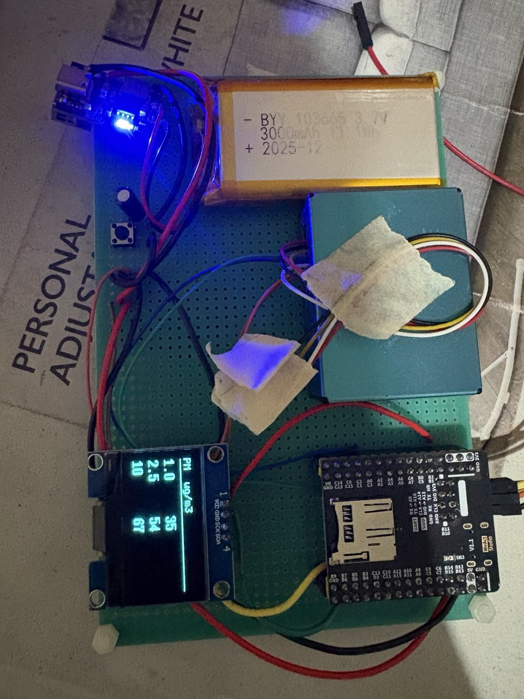

# STM32F446RETx and PSM5003

## pin connections

usart to user

- PA10 (usart1_rx) -> tx stlink
- PA9 (usart1_5x) -> rx stlink

uart4 to pms5003

- PA0 (uart4_tx) -> rx pms5003
- PA1 (uart4_rx) -> tx pms5003

i2c1 to SSD1106/SH1106 1.3 inch LCD (`i2c: device at 7-bit 0x3C (write 0x78).`)

- PB7 (SDA) -> LCD SDA
- PB6 (SCL) -> LCD SCK
- 3V -> LCD VCC
- GND -> LCD GND

## driver

for UART connection to user, use `ringbuffer.h` and `ringbuffer.c`

## data path

how one byte travels from the sensor to the OLED.

**1. isr, one byte per interrupt** — `UART4_IRQHandler` -> HAL -> `HAL_UART_RxCpltCallback`
(`Core/Src/driver_pmsx003_interface.c:87`). reception is armed one byte at a time by
`a_pmsx003_rx_start()` (`:71`, `HAL_UART_Receive_IT(..., 1)`). the callback stores the byte
and re-arms:

```c
(void)RingBuffer_Write(&gs_rx_buf, &byte, 1);   /* :94 */
(void)a_pmsx003_rx_start();                     /* :95 */
```

~960 interrupts/s at 9600 baud. `gs_rx_buf` is 1000 bytes (`Core/Inc/ringbuffer.h:6`).

**2. main loop pulls** — `HAL_Delay(2500)` then `pmsx003_read(&gs_pms, &data)`.

**3. driver reads back** — `Drivers/PMS5003/driver_pmsx003.c:689`, active mode branch:

```c
len = handle->uart_read(input, 64);   /* :709 */
if (len != 64) return 1;              /* :710, "read failed" */
res = handle->uart_flush();           /* :716, wipes the buffer */
```

`handle->uart_read` is a function pointer bound in `PMS_Init()` by
`DRIVER_PMSX003_LINK_UART_READ` to `pmsx003_interface_uart_read`
(`Core/Src/driver_pmsx003_interface.c:158`). static analysis cannot see this hop, the
`DRIVER_PMSX003_LINK_*` macros are the real edges.

**4. buffer drain** — the isr only advances `head`, the reader only advances `tail`, so only
the isr is held off:

```c
__HAL_UART_DISABLE_IT(PMSX003_UART, UART_IT_RXNE);   /* :168 */
n = RingBuffer_Read(&gs_rx_buf, buf, len);           /* :169 */
if (gs_rx_running != 0) __HAL_UART_ENABLE_IT(...);   /* :172 */
```

**5. frame sync and parse** — scan for `0x42 0x4D` (`:726`), 30 byte LRC check (`:733`-`:737`),
then `a_pmsx003_parse_data` (`:754`) fills `pmsx003_data_t`.

**6. out to the panel** — `PMS_ShowData()` -> `u8g2_SendBuffer` -> `u8x8_byte_stm32_hw_i2c`
(`Core/Src/u8g2_port.c`) buffers into `gs_i2c_buf` and flushes on `END_TRANSFER` via
`HAL_I2C_Master_Transmit` at 375 kHz to 0x78.

### known weak spot: intermittent "read failed" in clean air

`pmsx003_read` demands exactly 64 bytes (two frames) and then flushes, so every cycle starts
empty and must accumulate two full frames inside the 2.5 s delay.

the PMS5003 in active mode does not emit at a fixed 1 Hz. the interval is concentration
dependent: roughly 200-800 ms in dirty air, stretching to ~2.3 s +/- 0.2 s in clean air. at low
PM levels only one frame lands per window -> `len == 32` -> return 1 -> `"read failed"` on UART
and on the OLED.

not a wiring or sensor fault. fix is either raising the loop delay to ~5 s, or dropping the
flush and letting the ring buffer accumulate across iterations (1000 bytes holds 31 frames).

## components

- board: https://github.com/WeActStudio/WeActStudio.STM32F4_64Pin_CoreBoard
- driver: https://github.com/libdriver/pmsx003
- lcd: https://www.tokopedia.com/syalis-electrical/display-oled-1-3-biru-i2c-ssd1106-syalis

LCD characteristics:

```
Display Oled 1.3 inch
IIC
driver IC SSD1106/SH1106
3.3v - 5v
VCC - GND - SCK - SDA
blue
```

## ignore or maybe later

SET and RESET pins are not set, so those functions compile as no-ops behind #ifdef PMSX003_SET_Pin / PMSX003_RESET_Pin. To enable them:

1. Open pms5003.ioc in STM32CubeMX.
2. Pinout view -> click a free pin (e.g. PB0) -> select GPIO_Output. Repeat for a second pin (e.g. PB1).
3. Right-click PB0 -> Enter User Label -> PMSX003_SET. Right-click PB1 -> PMSX003_RESET.
4. System Core -> GPIO -> for both pins set: Output Level High, Mode Output Push Pull, Pull-up/Pull-down No pull-up and no pull-down, Speed Low.

## images


